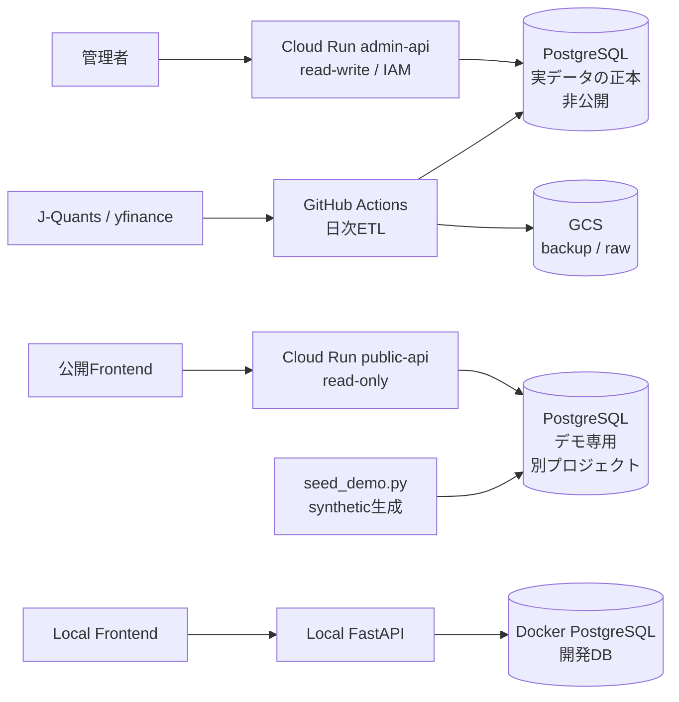

# Investment Monitoring Data Platform

投資判断に使う一次データを、**時点・取得元・取込実行まで追跡可能な形で蓄積する**データ基盤です。
現在はテーマ／投資対象のMasterと、株価／財務開示のObservedを対象に、ETL、API、Web、クラウド運用まで
一貫して実装しています。

| | |
|---|---|
| 公開デモ | https://invest-monitoring-frontend-540015602390.australia-southeast1.run.app |
| 公開API | https://invest-monitoring-public-api-540015602390.australia-southeast1.run.app/docs |

どちらもCloud Runで稼働中（読み取り専用）。テーマ、構成銘柄、株価、財務の実績・会社予想・開示履歴を閲覧できます。

> **公開デモのデータはすべて架空です。** 市場データの利用条件（第三者への提供の禁止）を踏まえ、
> 公開環境には実データを置かず、synthetic dataを別環境に用意しています。実データを扱う環境は
> 非公開で、データ・認証情報・DBを公開側と共有しません。

## ポイント

| 観点 | 実装内容 |
|---|---|
| データ設計 | Master / Observed / Derived / Assessmentを分離し、一次観測へ判断結果を混在させない |
| ETL | 増分取得、冪等UPSERT、部分失敗、rate limit、raw保存、取込実行・エラー履歴 |
| API | FastAPIのRouter / Repository / ETLを分離。公開系と管理系を同一イメージ・異なる権限で運用 |
| Web | Next.jsでテーマ、構成銘柄、株価、財務実績・会社予想・開示履歴を表示 |
| Cloud | Cloud Run、Neon PostgreSQL、GCS、Artifact Registry、Secret Manager、IAMを利用 |
| 運用 | GitHub ActionsによるCI/CD・日次ETL・バックアップ、readiness、復元検証 |
| 品質 | PostgreSQLを使うバックエンドテスト150件、フロントエンドテスト13件、型・lint・build検証 |

---

## WHY — 何のために作っているか

投資判断に使うデータは、株価や財務だけではありません。

金利・為替・業界統計、ニュース、決算イベント、需給、オルタナティブデータなど、投資仮説を検証する材料は複数のデータソースに分散しています。将来的にこれらを投資テーマや銘柄と結びつけて利用するには、まず**一次データを来歴・時点・意味を失わず蓄積できる土台**が必要です。

このプロジェクトでは、その土台として現在、銘柄・テーマのMaster Dataと、株価・財務のObserved Dataを整備しています。

取得元の異なる観測を衝突なく保持し、一次観測を上書きせず、DB上の値から取得元・取込実行・rawデータまで遡れることを重視しています。

### 現在のゴール

まず以下を再現可能なデータ基盤として完成させます。

* 投資テーマと銘柄の管理
* 株価・出来高の履歴取得
* 財務実績・会社予想・開示履歴の蓄積
* 取得元・取得時点・取込実行の追跡
* rawデータまで遡れるデータリネージ
* APIとWeb画面からの参照

### North Star

この基盤の先では、マクロ指標、カタリスト、ニュース、オルタナティブデータを追加し、

**「どの情報が、どのテーマ・銘柄・投資仮説に関係し、その時点で何を根拠に判断できたか」**

を構造化して扱える状態を目指します。

最終的には、Observed Data、Derived Data、Assessment、Decision、Outcomeを分離し、人間にもAIにも再利用可能な投資判断データ基盤へ拡張します。

AI-readyとは、単にデータをAIへ渡せることではなく、データの意味・対象・時点・来歴・加工過程を機械的に辿れる状態だと考えています。

---

## WHAT — 何を作ったか

### 現在できること

- Strategy、Theme、Investment Targetと、テーマ×投資対象の関係を管理する
- 監視対象の価格を増分取得し、取得元別の観測として保持する
- 財務開示、実績、会社予想、予想改訂を開示時点の履歴として保持する
- DBの値から取得元、取込実行、rawレスポンスまで遡る
- 公開デモでは架空データを読み取り専用で閲覧する
- 非公開Admin APIでは実データDBを限定的に更新する

### 今回のMVPに含めないもの

- 全上場銘柄の長期履歴をPostgreSQLへ集約すること
- ニュース本文やオルタナティブデータの無条件保存
- 投資評価、売買判断、バックテスト、AIによる推論
- 複数ユーザー向けの認証・権限管理

これらは先回りして物理テーブルを作らず、必要性が確定した段階でObserved / Derived / Assessmentの
各責務へ追加します。

### アーキテクチャ概要

公開APIと管理APIは**同じイメージ**を使い、Cloud Runサービス・DBロール・環境変数で権限を分けます。公開側は `DATABASE_READ_ONLY=true` とDB側の読み取り専用ロールを併用し、書き込み系はHTTPの入口で拒否します。

**公開APIの接続先は実データの正本ではなく、架空データだけを持つ別DBです。** 両者はスキーマとAPI契約を共有しますが、データ・認証情報・DBのプロジェクトを共有しません。GCSは正本ではなく、`pg_dump` バックアップとrawの保管先です。

### アプリケーション層（API）

FastAPIがテーマ、投資対象、価格、財務、取込実行履歴を提供します。

### データ層

データを責務で分離しています。

| 層 | 内容 | 状態 |
|---|---|---|
| Master | 何を観測・分類・投資するか | 実装済み |
| Observed | 外部から取得し正規化した一次観測（価格・財務開示） | 実装済み |
| Derived | Observedから再計算できる特徴量・リターン・リスク指標 | 未着手 |
| Assessment | 閾値・モデルによるバージョン付きの評価 | 未着手 |
| Decision | 評価を踏まえた意思決定 | 未着手 |
| Outcome | 約定・保有・損益という事実 | 未着手 |

### データフロー概要

外部API、ETL、PostgreSQL、API、Webを分離し、取得元から画面表示まで追跡できる構成にしています。

### DB設計概要

ER図、列の意味・粒度・単位、型・制約・インデックスを文書化しています。構造リファレンスとER図は
Alembic migrationから自動生成し、手書きのデータ定義書との不一致をCIで検出します。

---

## HOW — どう作ったか

### 技術スタック

| レイヤー | 技術 |
|---|---|
| バックエンド | Python 3.11 / FastAPI / psycopg |
| DB | PostgreSQL 17 / Alembic |
| フロントエンド | Next.js 16 / TypeScript / Tailwind CSS |
| データ取得 | J-Quants API / yfinance |
| インフラ | Cloud Run / Cloud Storage / Artifact Registry / Secret Manager / IAM / Neon |
| CI/CD | GitHub Actions（lint・型・テスト・Dockerビルド / deploy / 日次ETL / backup） |

### 設計上の判断

一般的な規約ではなく、**このプロジェクト固有の判断**を残しています。

- **既存ツールと競合する機能は作らない** — 高機能チャートや全銘柄スクリーナーは既存サービスを利用し、本プロジェクトではデータの統合・来歴管理・投資仮説との関連付け・事後検証に集中する
- **データの利用条件を環境分離で担保する** — 市場データの再配布を避けるため、公開デモは架空データ専用のDBを別プロジェクトに置く。公開環境に実データが物理的に存在しない状態にし、運用の注意ではなく構成で守る
- **評価・判断を観測Factに混ぜない** — 閾値や判定結果をFactテーブルに持たせると、ルールを変えるたびにFactを作り直すことになる
- **SQLアクセスを集約する** — Routerはドメインモデルを扱い、SQLはRepositoryまたはデータ更新処理へ集約する
- **全市場データをServing DBへ集約しない** — PostgreSQLは監視・Web表示に必要な範囲へ限定し、将来の全市場履歴はGCS / Parquetで扱う
- **欠損をゼロで埋めない** — 未提供・非開示・対象外はすべて `NULL`。IFRSに経常利益が無いことと、値がゼロであることを区別する
- **推測で実装しない** — 外部APIの項目名や制限は実レスポンスで確認してから書く。資料の記載と実際が食い違った例が複数ある

### データ品質・トレーサビリティ

- **一次観測を上書きしない** — 取得元が違う同じ日付は別行として保持する（`(target_id, source_id, obs_date)`）
- **訂正開示を残す** — 決算の訂正は開示番号が違えば別レコードとし、元の開示を書き換えない
- **来歴を辿れる** — 取得元、取込実行、取得時点、原レコードのハッシュを記録し、DB値からrawまで遡れる
- **価格の意味を混在させない** — `price_basis`を必須にし、調整済み、未調整、由来不明を区別する
- **再実行で重複させない** — ETLを冪等にし、同じ入力を再取得しても行を増やさない
- **回復可能な部分失敗を記録する** — 1銘柄の失敗で全体を止めず、`ingestion_error`に理由と再試行可否を残す

### 品質の担保

| | |
|---|---|
| テスト | バックエンド150件（実PostgreSQLに対して実行） / フロントエンド13件 |
| CI | PRとmainへのpushで lint・型・テスト・Dockerビルドを実行 |
| ドキュメント整合 | スキーマとデータ定義書の乖離を**CIで検出**。更新漏れはテストが落ちる |
| バックアップ | イミュータブルバックアップを日次取得し、**復元を実際に検証** |

テストは構造ではなく振る舞いを検証します（「テーブルが存在する」ではなく「再実行しても行が増えない」）。

---

## ドキュメント

アーキテクチャ、データ定義、取得元ポリシー、開発手順は
[docs/](docs/README.md)にまとめています。
