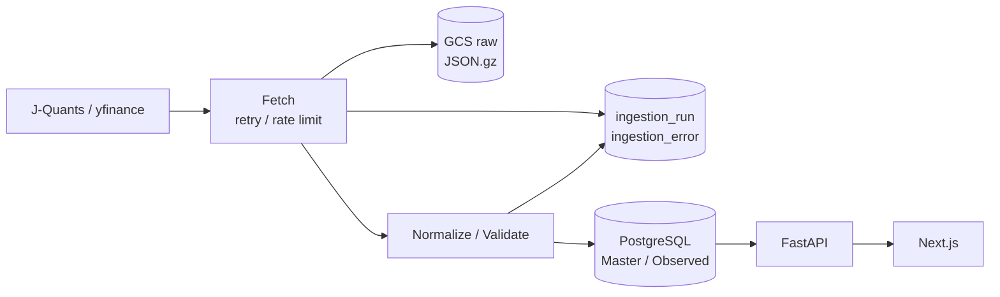
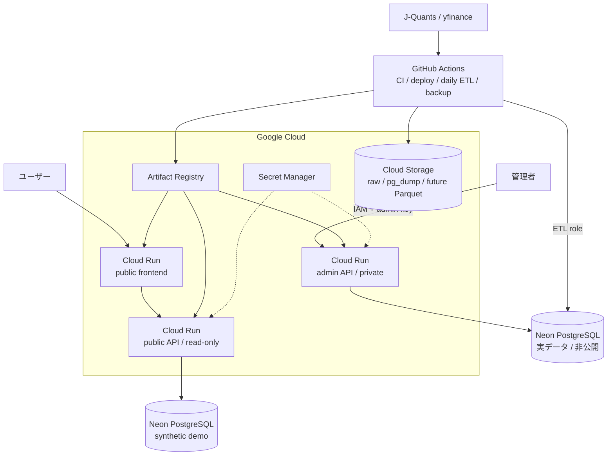

# アーキテクチャ

この文書は、データフロー、実行環境、権限境界、FastAPI内部の責務をまとめたシステム構成の正本です。
列定義や取得元の選択は扱いません。

## 全体データフロー

非公開の実データ環境では、外部APIから取得したデータをraw保存、正規化、検証してPostgreSQLへ
ロードし、FastAPIとNext.jsから利用します。

公開デモには外部取得データを流しません。同じスキーマとAPI契約を使いながら、別PostgreSQLに
投入したsynthetic dataだけを参照します。

| 層 | 責務 | 主な実装 |
|---|---|---|
| 外部データ | 原データの提供 | J-Quants、yfinance |
| 取得・ETL | 取得、raw保存、正規化、検証、冪等ロード、失敗記録 | Python、GitHub Actions |
| データ | 内部のMasterとObservedの保持 | PostgreSQL、GCS |
| アプリケーション | データアクセス、HTTP提供、画面表示 | FastAPI、Next.js |

## 実行環境

| サービス | 役割 |
|---|---|
| Cloud Run | Next.jsとFastAPIのコンテナを実行する |
| Artifact Registry | デプロイ対象のDockerイメージを保管する |
| Secret Manager | DB接続URLと管理キーを実行時に渡す |
| GCS | rawレスポンス、`pg_dump`、将来のParquetを保管する |
| Neon PostgreSQL（実データ） | ETLと認証済み管理操作が更新する正本。公開しない |
| Neon PostgreSQL（デモ） | 公開APIが読むsynthetic data。実データと認証情報を共有しない |
| GitHub Actions | CI、build、deploy、日次ETL、バックアップを自動化する |

## 公開・管理・開発環境の境界

公開APIと管理APIは同じDockerイメージを使い、Cloud Runサービス、環境変数、DBロール、IAMを
変えて運用します。公開APIはアプリ側のread-only guardとDB側のread-only roleを重ねます。

| 環境 | 接続先 | 公開範囲 | HTTP操作 | DB権限 |
|---|---|---|---|---|
| public | syntheticデモDB | 一般公開 | GET / HEAD / OPTIONS | SELECTのみ |
| admin | 実データDB | 管理者のみ | CRUD | `app_writer`の限定的な読み書き |
| daily ETL | 実データDB | 非公開 | バッチ | `etl_writer`の対象テーブル更新 |
| migration | 実データDB | 非公開 | Alembic | Owner権限 |
| local | Docker PostgreSQL | localhost | CRUD | 開発用権限 |
| CI | workflow内PostgreSQL | workflow内 | テスト中のみ | テスト用権限 |

管理APIはCloud Run IAMと`X-Admin-Key`で保護し、管理用Secretをブラウザへ埋め込みません。スキーマ変更は
日次ETLやアプリ起動時に行わず、リリース時にAlembicを明示実行します。

開発DBと本番DBのデータは自動同期しません。同期するのはAlembicで管理するスキーマだけです。
本番相当データが必要な場合も、本番から開発へ一方向に復元し、開発DBを本番へアップロードしません。

## 保存責務

| データ | 正本・保存先 | 書き手 |
|---|---|---|
| 実データのMaster / Observed | 実データPostgreSQL | 日次ETL、認証済み管理API |
| 公開デモデータ | デモPostgreSQL | `seed_demo.py` |
| DBバックアップ | GCS `postgres-backups/` | GitHub Actions |
| API rawレスポンス | GCS `raw/` | GitHub Actions |
| 全市場Observed / Derived | 将来のGCS Parquet | 将来の分析パイプライン |
| ローカル開発データ | Docker PostgreSQL volume | ローカルAPI、開発者 |

PostgreSQLはWeb Servingに必要な範囲へ限定します。全市場・長期履歴が必要になった場合はGCS Parquetを
分析入力として追加し、DuckDB / dbtでDerivedやmartを生成します。GitHub Actionsで実行時間、再試行、
並列性が不足した場合だけ、バッチ実行先をCloud Run Jobs等へ交換します。

## FastAPI内部の責務

| コンポーネント | 責務 |
|---|---|
| Router | HTTP入力、認証結果、レスポンスモデルを扱う |
| Repository | PostgreSQLへの検索・CRUDを扱う |
| 更新スクリプト | 外部取得、raw保存、正規化、検証、ロードを扱う |
| `/api/data` | 更新処理の起動と`ingestion_run`の参照を扱う |

RouterへSQL、ETL、投資判断ロジックを置きません。`/api/data`も処理本体を持たず、更新スクリプトへ
委譲します。稼働中のエンドポイントと入出力仕様はFastAPIが生成するOpenAPIを正本とします。

## FrontendをCloud Runへ置く理由

Backend、Artifact Registry、Secret Manager、IAM、ログ確認がGoogle Cloudにあるため、Frontendも
Cloud Runへ置き、build、deploy、権限、障害調査の運用境界を集約しています。現在はVercel固有の
Preview DeploymentやEdge Runtimeを必要としていません。これらが要件になった場合だけ、Frontendの
配置先を再評価します。
