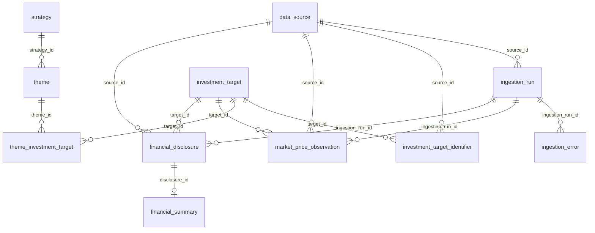
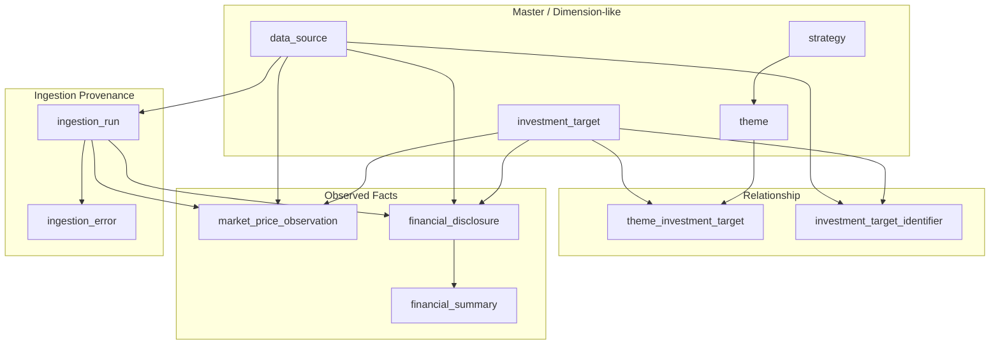

# ER Diagram

投資判断プラットフォームの現行 DB スキーマを表す ER 図です。

スキーマ定義の正本は [Alembic migration](../../backend/migrations/versions/) です。

## ER 図

<!-- generated:er-diagram start -->

<!-- generated:er-diagram end -->

## テーブル一覧

| テーブル | 説明 |
|---|---|
| `strategy` | 投資戦略マスタ |
| `theme` | 投資テーマ。`strategy_id`で戦略に所属 |
| `investment_target` | 投資対象マスタ（個別株・ETF・投資信託・REIT・債券・指数・商品） |
| `data_source` | J-Quants、FRED等のデータ取得先 |
| `investment_target_identifier` | 内部銘柄とJ-Quants Code、ticker等の対応 |
| `ingestion_run` | データ取得・ETLの実行履歴と件数 |
| `ingestion_error` | 実行中の部分失敗と再試行可否 |
| `theme_investment_target` | テーマ×銘柄（basket_weight） |
| `market_price_observation` | 銘柄・取得元・取引日単位のOHLCV価格観測と来歴 |
| `financial_disclosure` | 開示番号ごとの決算開示履歴 |
| `financial_summary` | 開示に対応する実績・会社予想・配当サマリー |

## 役割別構成

